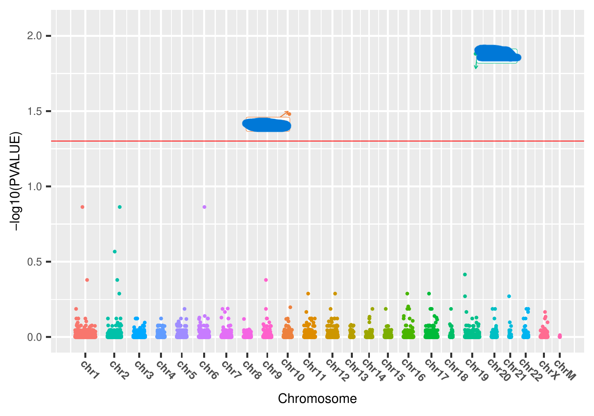

# Risk-gene-for-Alzheimer-s-disease-

This project aims to identify risk genes for Alzheimer’s disease using large cohort datasets from ROSMAP.

## Table of Contents
- [Introduction](#introduction)
- [Phenotype Data](#phenotype-data)
- [Spinal Cord Proteomics Subset](#spinal-cord-proteomics-subset)
- [Modified GEMMA Model](#modified-gemma-model)
- [Running GEMMA](#running-gemma)
- [Pathway Analysis](#pathway-analysis)

## Introduction

This project aims to identify risk factors for Alzheimer’s disease (AD) and motor-related disorders, and to investigate shared and distinct biological mechanisms underlying these conditions.

The primary datasets come from the ROSMAP (Religious Orders Study and Memory and Aging Project) consortium. We analyze multi-tissue, multi-omic data including:

- **DLPFC (dorsolateral prefrontal cortex)**  
 800 proteomics samples
- **SMA (supplementary motor area)**  
  ~500 samples
- **VH (ventral horn of spinal cord)**  
  ~500 RNA-seq and proteomics samples
- **Quadriceps muscle**  
  ~500 samples

## Phenotype Data

The ROSMAP phenotype dataset includes extensive clinical, demographic, cognitive, motor, and neuropathological variables, including:

- **Demographics:** projid, study, age_at_visit, age_death, educ, msex, race7
- **Cognitive measures:** cogn_global, cts_mmse30, cogdx
- **Motor function:** gait_speed, motor_dexterity, motor_gait, motor_handstreng, motor10, bradysc, gaitsc, parksc, rigidsc, tremsc
- **Clinical history:** hypertension_cum, cancer_cum, dm_cum, stroke_cum, heart_cum, headinjrloc_cum, vasc_risks_sum
- **Medication usage:** analgesic_rx, antibiotic_rx, antihyp_all_rx, cardiac_rx, lipid_lowering_rx, mental_health_rx, anti_inflammatory_rx, aspirin_rx, diabetes_rx, antianxiety_rx, insomnia_rx
- **Neuropathology:** LewyBody, braaksc, ceradsc, niareagansc, amyloid, tangles, tdp_stage4, arteriol_scler, caa_4gp, cvda_4gp2
- **Genetics:** apoe_E2, apoe_E4, TOMM40_S, TOMM40_L, TOMM40_VL
- **Psychosocial traits:** extraversion_6, anxiety_10items, neuroticism_12, angertrait, early_hh_ses

## Spinal Cord Proteomics Subset

For demonstration and testing, we use a subset of the spinal cord proteomics dataset containing:

- Metadata: TMT_plex, TMT_channel, SampleName, ProjID, Plate, cogng, demog_slope, age_death, msex
- Protein abundance values for ~9,800 proteins

Theue to data use restrictions. Authorized users may access the data via the AD Knowledge Portal  
(Synapse ID: **syn2580853**).

## Modified GEMMA Model

We use a modified workflow based on **GEMMA** (Genome-wide Efficient Mixed Model Association), which supports:

- GWAS
-ation
- Multi-trait mixed model analysis

Resources:
- GEMMA GitHub: https://github.com/genetics-statistics/GEMMA
- Yang Lab (Emory): [Software Resources](https://yanglab-emory.github.io/pages/software.html)

## Running GEMMA

The script [get_GEMMA_input_Spinal_cord_protein.r](/scripts/get_GEMMA_input_Spinal_cord_protein.r)
generates GEMMA-formatted input files from proteomics and phenotype data.

Example outputs:
- `Spinal_cord_protein_anno.tsv`
- `Spinal_cord_protein.<phenotype>.tsv`

Example format:

```text
gene   A   T     X1        X2        X3        X4
NOC2L  A   T   0.0140   -0.2120   -0.1880   -0.1050
ISG15  A   T  -0.3350    0.3950    0.3490   -0.1330
``

We run GEMMA using the script [sbatch_gemma.sh](/scripts/sbatch_gemma.sh). For each tissue × phenotype combination, we extract key association statistics for downstream analysis.
Example GEMMA output:
```Code
chr   rs       ps        beta        se          logl_H1     l_remle     l_mle     p_wald   p_lrt   p_score
chr1  NOC2L    944203   5.60e-02   1.07e-01    8.54e+01    1.00e+05    1.00e+05   0.6009   0.5968  0.5971
chr1  PERM1    975198  -8.93e-02   1.20e-01    8.55e+01    1.00e+05    1.00e+05   0.4568   0.4518  0.4523
chr1  ISG15   1001138   8.26e-02   3.85e-02    8.76e+01    1.00e+05    1.00e+05   0.0326   0.0307  0.0315
```
These results are then used for visualization (, Upset plots via [Analyze_GEMMA_outputs.r](/scripts/Analyze_GEMMA_outputs.r).

## Pathway Analysis

To compare biological pathways involved in AD and motor related disorders, we perform GSEA (Gene Set Enrichment Analysis) using:
•	[get_rnk_file.r](/scripts/get_rnk_file.r) — generates ranked gene lists
•	[gsea_analysis_preranked.sh](/scripts/gsea_analysis_preranked.sh) — runs GSEA in preranked mode
Pathway visualizations (e.g., NES distributions, leading edge summaries) are produced using:
•	[gsea_out_visualization.r](/scripts/sig_pathwar_plot.r) (ggplot2 based)


